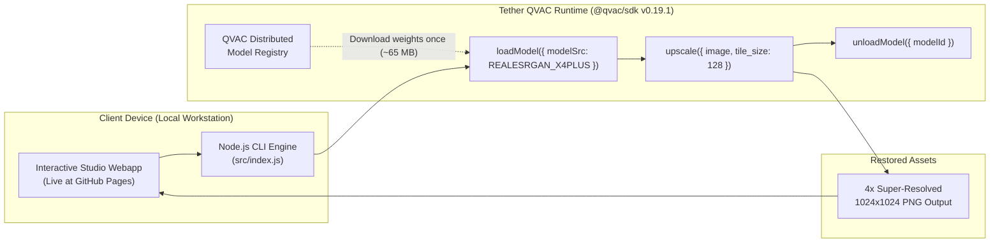

# PixelRevive ✨ // On-Device ESRGAN Super-Resolution

<p align="center">
  
</p>

<p align="center">
  <a href="https://sunisethereal-dot.github.io/pixelrevive"></a>
  <a href="https://qvac.tether.io"></a>
  <a href="https://npmjs.com/package/@qvac/sdk"></a>
  <a href="https://nodejs.org/"></a>
  <a href="LICENSE"></a>
  <a href="#"></a>
</p>

<p align="center">
  🌐 <strong>Live Webapp:</strong> <a href="https://sunisethereal-dot.github.io/pixelrevive">https://sunisethereal-dot.github.io/pixelrevive</a>
</p>

---

## 🌟 Overview

**PixelRevive** is a high-performance, on-device AI image super-resolution application engineered with **Tether's open-source QVAC SDK** (`@qvac/sdk v0.19.1`). It enhances, sharpens, and reconstructs low-resolution `.jpg` and `.png` images by 4x using Real-ESRGAN running entirely inside local memory—requiring **zero cloud API keys, zero external network requests, and zero data egress**.

- ⚡ **100% On-Device Neural Execution:** Pure local inference executing on consumer CPU/GPU hardware powered by Tether's QVAC runtime.
- 🌐 **Live Web Application:** Interactive dark-mode comparison cockpit with smooth 60fps split slider, drag-and-drop ingestion, and instant preview.
- 📦 **Ultra-Lean Footprint:** Lightweight weights (~65 MB) streamed dynamically from Tether's distributed QVAC model registry.
- 🛡️ **Air-Gapped Privacy Shield:** Your personal photos, documents, and assets never leave your local device.

---

## ⚡ Why Tether's QVAC SDK?

Traditional AI image upscaling relies on expensive cloud APIs with latency, monthly subscriptions, and severe privacy risks. **Tether's QVAC SDK** transforms this paradigm by bringing state-of-the-art neural models directly to local devices:

1. **Zero API Cost & Unlimited Usage:** Run unlimited 4x super-resolution passes without token quotas or credit card billing.
2. **True Air-Gapped Privacy:** Zero bytes uploaded to third-party servers. Ideal for confidential documents, personal memories, and sensitive graphic assets.
3. **Optimized Distributed Distribution:** QVAC's distributed model store downloads models once (~65 MB) and caches them locally for near-instant subsequent boots.
4. **Memory-Safe Execution:** Native tile partitioning (`tile_size: 128`) guarantees smooth inference without Out-Of-Memory (OOM) crashes even on standard consumer laptops.

---

## 🔬 QVAC Architecture & Execution Pipeline



---

## 📋 QVAC SDK Functions & Specifications Table

| Metric / Item | Specification | Details |
| :--- | :--- | :--- |
| **SDK Package** | `@qvac/sdk` | Verified `0.19.1` via `npm list @qvac/sdk` |
| **Model ID / Constant** | `REALESRGAN_X4PLUS` | `RealESRGAN_x4plus.pth` (~67.0 MB) |
| **Model Type** | `"diffusion"` | Standalone upscaler mode |
| **Model Config** | `{ mode: "upscale", upscaler: { tile_size: 128 } }` | `tile_size: 128` prevents CPU memory spikes |
| **Primary SDK Functions** | `loadModel()`, `upscale()`, `unloadModel()` | Verified exports directly from SDK API |
| **Cloud Telemetry** | `0.00 KB` | Pure local memory execution |

---

## ⚡ Prerequisites

- **Node.js**: `>= 22.17.0` (Verify with `node -v`)
- **npm**: `>= 10.9.0`
- **Operating System**: Windows 10/11 x64, macOS, or Linux

---

## 🚀 Installation & Quickstart

### 1. Clone the Repository
```bash
git clone https://github.com/sunisethereal-dot/pixelrevive.git
cd pixelrevive
```

### 2. Install Dependencies
```bash
npm install
```

### 3. Verify SDK Version
```bash
npm list @qvac/sdk
```
*Output: `@qvac/sdk@0.19.1`*

### 4. Run the Upscaler (CLI + Web UI)

Set the config environment variable and run:
```powershell
$env:QVAC_CONFIG_PATH="./qvac.config.json"; node src/index.js
```

*(On Linux / macOS: `QVAC_CONFIG_PATH="./qvac.config.json" node src/index.js`)*

> [!NOTE]
> The first run downloads the Real-ESRGAN weights (~65 MB). Subsequent runs execute instantly from local cache!

### 5. Open the Interactive Comparison Slider
Open your browser to:
👉 **`http://127.0.0.1:3000`**

Drag the slider to compare the original low-res image against the 4x ESRGAN super-resolution output!

### 6. Run Pure CLI Mode on Custom Images
```bash
node src/index.js path/to/your-photo.jpg
```
The enhanced result will be saved to `outputs/upscaled.png`.

---

## 🧠 QVAC SDK Integration Details

PixelRevive follows the standard QVAC lifecycle:

```javascript
import fs from 'node:fs';
import { loadModel, upscale, unloadModel, REALESRGAN_X4PLUS } from '@qvac/sdk';

// 1. Load Real-ESRGAN standalone model
const modelId = await loadModel({
  modelSrc: REALESRGAN_X4PLUS,
  modelType: "diffusion",
  modelConfig: {
    mode: "upscale",
    upscaler: { tile_size: 128 }
  },
  onProgress: (p) => console.log(`Downloading: ${p.percentage}%`)
});

// 2. Read image buffer and run 4x super-resolution
const imageBytes = fs.readFileSync('sample.jpg');
const { outputs, stats } = upscale({
  modelId,
  image: imageBytes,
  repeats: 1
});

const [upscaledBuffer] = await outputs;
fs.writeFileSync('outputs/upscaled.png', upscaledBuffer);

// 3. Unload model to release VRAM/RAM
await unloadModel({ modelId });
```

---

## 📚 Official Tether QVAC Resources

- 🌐 **Tether QVAC Official Site:** [https://qvac.tether.io](https://qvac.tether.io)
- 📖 **Complete QVAC Documentation:** [https://docs.qvac.tether.io](https://docs.qvac.tether.io)
- 🚀 **QVAC Getting Started Guide:** [https://docs.qvac.tether.io/sdk/getting-started/quickstart/](https://docs.qvac.tether.io/sdk/getting-started/quickstart/)
- 📦 **NPM Package (@qvac/sdk):** [https://www.npmjs.com/package/@qvac/sdk](https://www.npmjs.com/package/@qvac/sdk)
- ⭐ **Tether QVAC GitHub Repository:** [https://github.com/tetherto/qvac](https://github.com/tetherto/qvac)

> [!TIP]
> If you find on-device AI exciting, give Tether's team a ⭐ on [github.com/tetherto/qvac](https://github.com/tetherto/qvac)!

---

## 📄 License

Licensed under the **Apache License, Version 2.0**. See [`LICENSE`](LICENSE) for complete terms.
